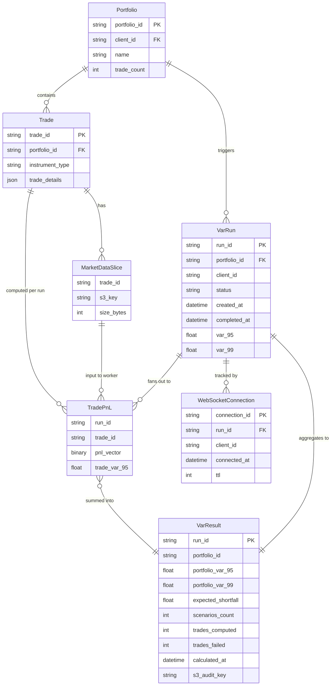
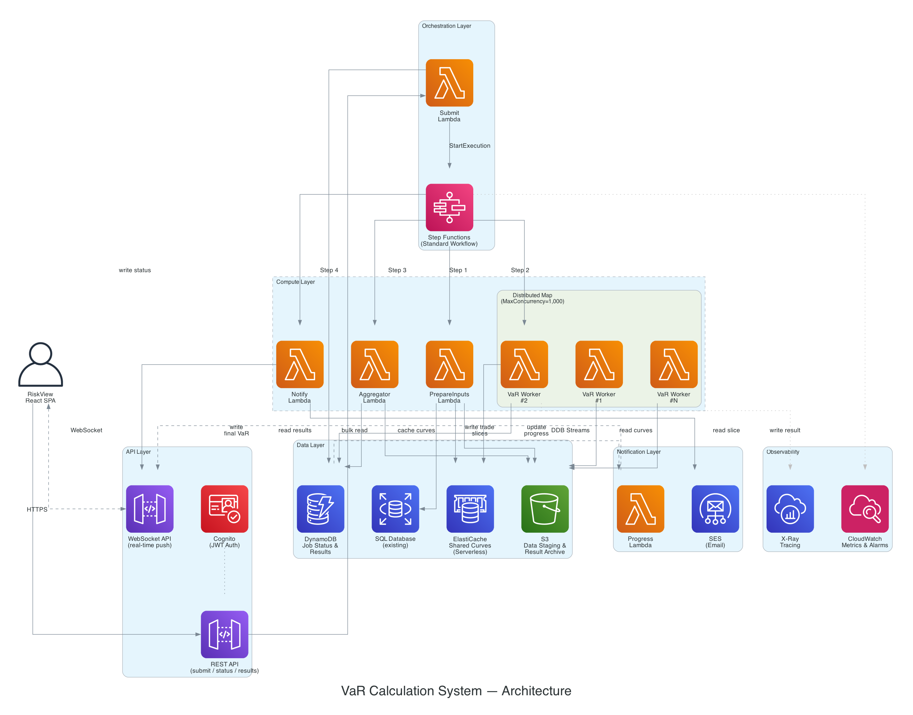
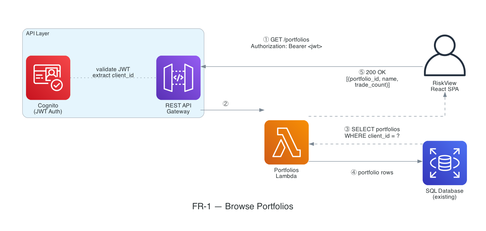
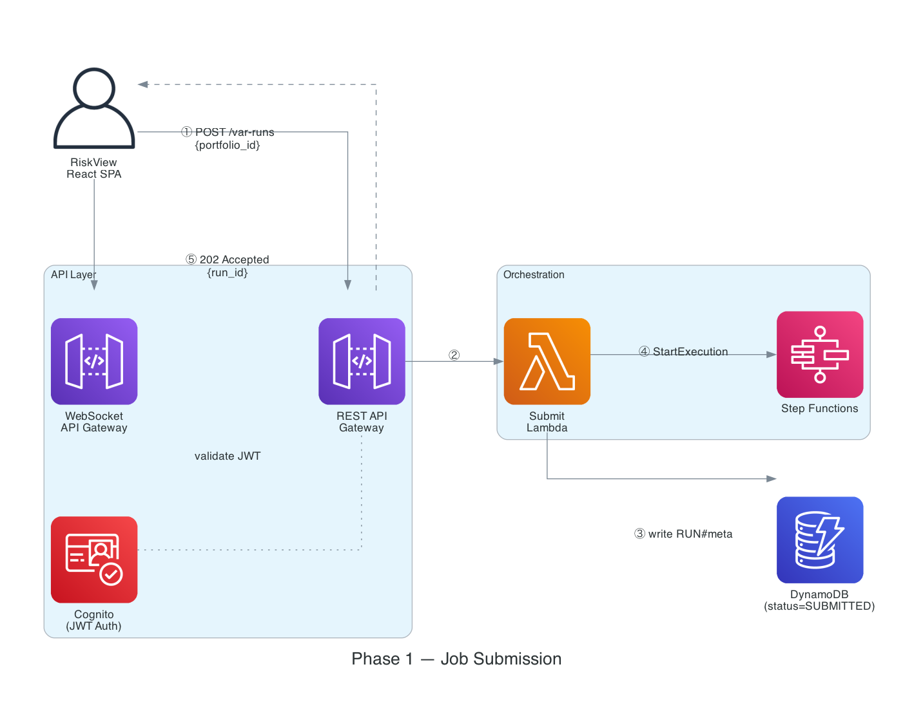
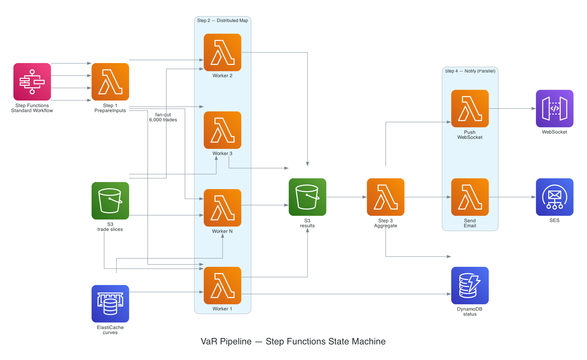
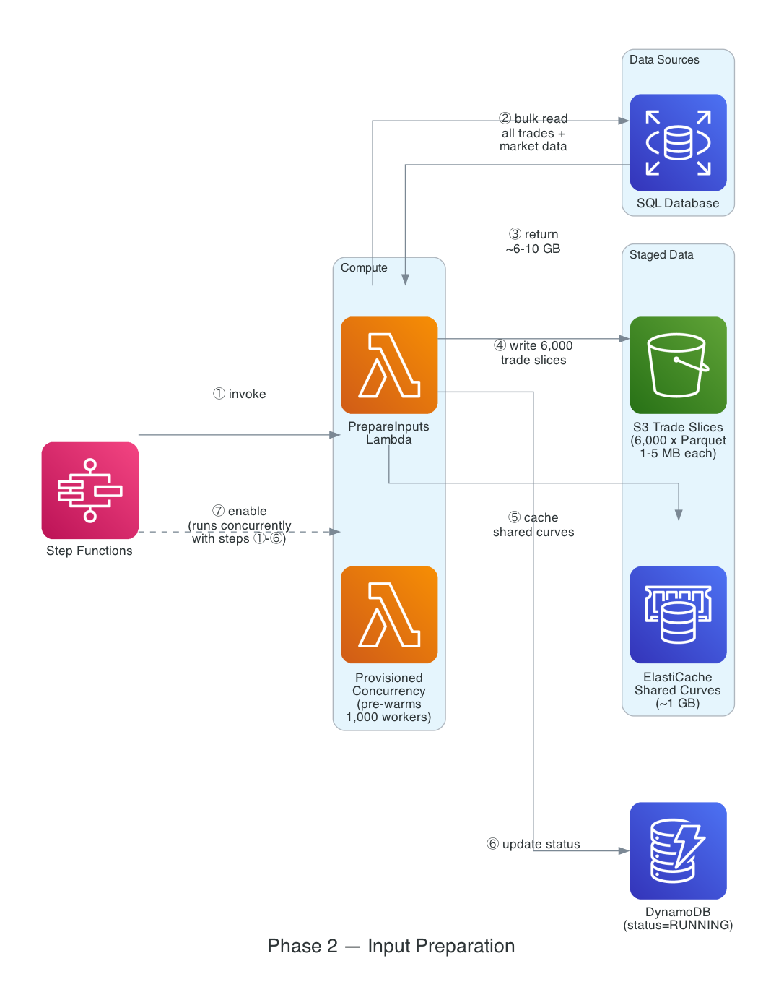
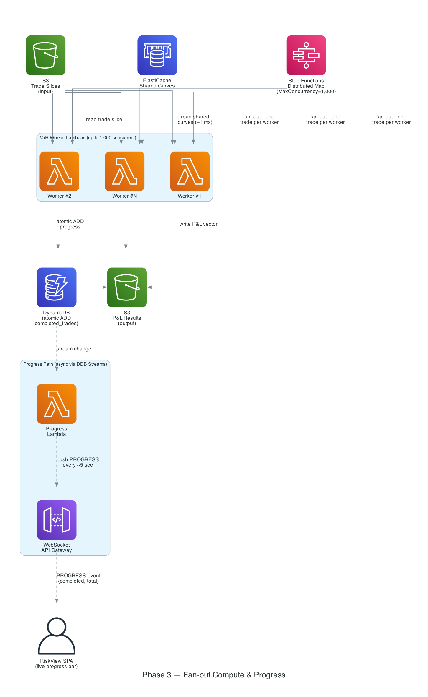
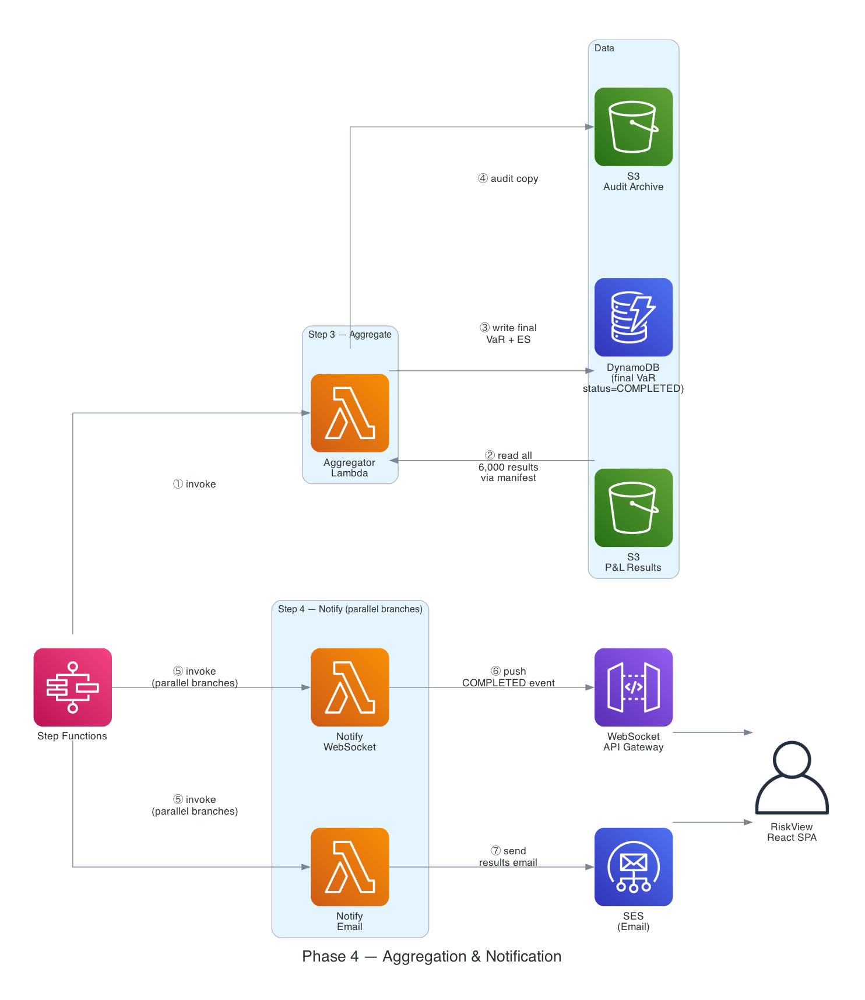
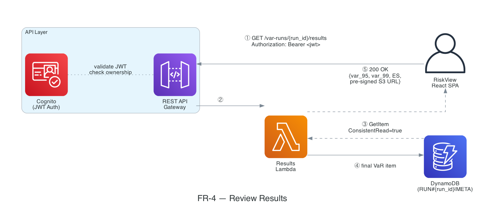
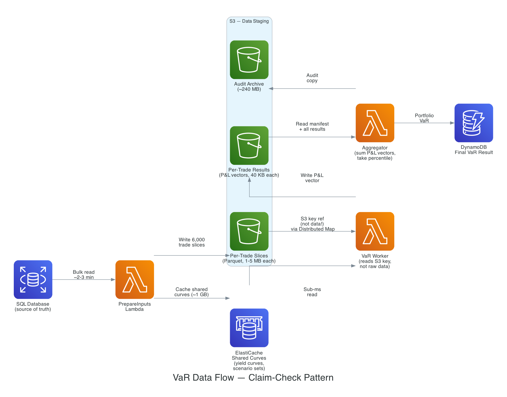

<h1 align="center">Distributed Value-at-Risk (VaR) Calculation System</h1>
<h3 align="center">System Architecture Design for RiskView — Validus Risk Management</h3>

**We'll cover the following:**

* [1. Requirements](#1-requirements)
* [2. Core Entities](#2-core-entities)
* [3. API / System Interface](#3-api--system-interface)
* [4. High-Level Design](#4-high-level-design)
* [5. Deep Dives](#5-deep-dives)

---

Validus offers Value-at-Risk (VaR) calculations to its clients through RiskView, a risk analytics platform with a React SPA frontend. A portfolio consists of thousands of trades, each requiring a single-threaded VaR calculation that may take up to one minute. Trade data and market data (several MB per trade) reside in a SQL database. Clients submit VaR requests on-demand and expect results — with in-app and email notifications — within 15 minutes.

---

## 1. Requirements

### Functional Requirements

| # | Requirement | Priority |
|---|---|---|
| FR-1 | **Browse Portfolios** — Authenticated client can view and select from their available portfolios in RiskView | Must-have |
| FR-2 | **Submit VaR Run** — Client selects a portfolio and submits a request to run a VaR calculation | Must-have |
| FR-3 | **Notify on Completion** — Client receives an in-app notification (real-time push to the SPA) and an email when results are ready | Must-have |
| FR-4 | **Review Results** — Client can view and explore the VaR outcome on RiskView after receiving notification | Must-have |

### Non-Functional Requirements

| # | Requirement |
|---|---|
| NFR-1 | **Scalability** — The system must handle portfolios of up to 6,000 trades. |
| NFR-2 | **Performance** — Results must be delivered within 15 minutes of submission. |
| NFR-3 | **Consistency** — The system must guarantee that once a run is marked COMPLETED, all results are fully and durably persisted — a client reading results immediately after receiving a notification must see the final state, never a stale or partial one. The system prioritizes consistency over availability (CP) for the final result write: DynamoDB `ConsistentRead=true` and conditional status writes ensure read-after-write consistency. Intermediate pipeline status transitions are not client-visible during computation and may be eventually consistent (AP). |
| NFR-4 | **Resilience** — The system must handle both transient and permanent trade failures without aborting the full run. For transient failures (worker crash, timeout), only the affected trade should be retried — completed results must be durable so nothing already computed is lost. For permanent failures (bad data, unrecoverable computation error), the run should complete on the remaining trades provided fewer than 1% fail — a portfolio VaR computed on 99% of trades is still a valid result. |
| NFR-5 | **Security & compliance** — All financial data must be encrypted at rest and in transit, with full auditability of every data access. *(Standard requirement for any financial system — acknowledged but not the unique engineering challenge of this design.)* |

### Assumptions

| # | Assumption | Justification |
|---|---|---|
| A1 | **Trades are independent** — no cross-trade dependencies in VaR calculation | Most institutional VaR implementations (Historical Simulation, Monte Carlo) compute per-trade P&L vectors independently and aggregate at the portfolio level. Cross-trade dependencies (e.g., netting) are typically handled in a pre-processing step, not within the VaR engine itself. This assumption enables flat fan-out without a DAG scheduler. |
| A2 | **VaR method is Historical Simulation** — per-trade output is a P&L vector (one value per historical scenario), not a scalar | Historical Simulation is the most widely used VaR methodology in risk management. It produces per-trade P&L vectors that can be summed element-wise across trades before taking the percentile — this naturally maps to a fan-out/reduce architecture. If Validus uses Monte Carlo, the same architecture applies (P&L vector per simulation path). |

---

## 2. Core Entities

### Entity List



A **Portfolio** is the top-level unit a client submits for VaR calculation. It is composed of **Trades** — each Trade representing a single financial instrument requiring its own independent VaR computation. The `trade_count` on a Portfolio directly determines the fan-out width of the Distributed Map: submitting a 6,000-trade portfolio spawns 6,000 concurrent worker invocations. This one-to-many relationship between Portfolio and Trade is the structural reason parallelisation is the central engineering challenge of this system.

---

## 3. API / System Interface

### REST API (via API Gateway → Lambda)

All endpoints require authentication via Cognito JWT token. Client identity is derived from the token, not from the request body.

#### Get Portfolios

```
GET /portfolios
Authorization: Bearer <jwt_token>

Response: 200 OK
{
    "portfolios": [
        {
            "portfolio_id": "port_abc123",
            "name": "Global Macro Book",
            "trade_count": 6284
        },
        {
            "portfolio_id": "port_def456",
            "name": "EM Rates Book",
            "trade_count": 3102
        }
    ]
}
```

The `trade_count` is included so the SPA can surface portfolio size to the client before submission — a 6,000-trade portfolio takes longer than a 500-trade one. This reads from the existing SQL database via the same Lambda pattern used by all REST endpoints.

#### Submit VaR Run

```
POST /var-runs
Authorization: Bearer <jwt_token>
Content-Type: application/json

Request Body:
{
    "portfolio_id": "port_abc123"
}

Response: 202 Accepted
{
    "run_id": "run_7f3a9b",
    "status": "SUBMITTED",
    "portfolio_id": "port_abc123",
    "total_trades": 6284,
    "created_at": "2025-05-01T14:30:00Z",
    "websocket_channel": "/runs/run_7f3a9b"
}
```

#### Get Run Results

```
GET /var-runs/{run_id}/results
Authorization: Bearer <jwt_token>

Response: 200 OK
{
    "run_id": "run_7f3a9b",
    "status": "COMPLETED",
    "portfolio_id": "port_abc123",
    "results": {
        "var_95": 1250000.00,
        "var_99": 2100000.00,
        "expected_shortfall_95": 1680000.00,
        "scenarios_count": 5000,
        "trades_computed": 6282,
        "trades_failed": 2,
        "degraded": true,
        "degradation_note": "2 trades failed (<1% threshold). Portfolio VaR computed on 6282/6284 trades."
    },
    "calculated_at": "2025-05-01T14:38:42Z",
    "s3_report_url": "https://..."   // Pre-signed URL, 1-hour expiry
}
```

### WebSocket Interface (via API Gateway WebSocket)

**Why WebSocket over SSE:** Server-Sent Events (SSE) would be the semantic fit for this one-directional server-to-client push pattern — the client never needs to send data after the initial subscribe. However, API Gateway (REST/HTTP) imposes a hard 29-second integration timeout, which makes SSE impossible for a run that can last up to 15 minutes without introducing a separate ALB + ECS streaming service. Since API Gateway is already present for all REST endpoints and API Gateway WebSocket is the same managed service (same Cognito auth, same CloudWatch logs, same WAF), it is used here rather than adding new infrastructure. AppSync subscriptions were also considered but would require replacing the REST API design with GraphQL — an unnecessary change for a single notification pattern.

The React SPA subscribes to a WebSocket channel upon submitting a VaR run to receive completion and failure notifications.

#### Connection

```
// Client connects with run_id as a query parameter.
// The $connect handler records the association immediately — no subscribe message needed.
wss://ws.riskview.validus.com?run_id=run_7f3a9b
```

#### Server-Pushed Events

```
// Completion notification
{
    "event": "COMPLETED",
    "run_id": "run_7f3a9b",
    "var_95": 1250000.00,
    "var_99": 2100000.00,
    "duration_sec": 512
}

// Failure notification
{
    "event": "FAILED",
    "run_id": "run_7f3a9b",
    "error": "More than 1% of trade calculations failed (47/6284).",
    "failed_trades": 47
}
```

### Email Notification (via SES)

Triggered by the Notify step of the pipeline. Template-based HTML email:

```
Subject: "VaR Calculation Complete — Portfolio {portfolio_name}"
Body:
  - Portfolio name and ID
  - VaR at 95% and 99% confidence
  - Expected Shortfall
  - Trade count and any failures
  - Link to view results in RiskView: https://riskview.validus.com/runs/{run_id}
  - Timestamp
```

---

## 4. High-Level Design

### From the APIs to Core Components

The three REST endpoints and WebSocket interface defined in §3 drive the component selection directly:

| API Contract | What it needs |
|---|---|
| `GET /portfolios` | A read path from the existing SQL database — no new storage needed |
| `POST /var-runs` | An async trigger: accept the request immediately, hand off a long-running pipeline, return a `run_id`. The client cannot block while 6,000 trades compute. |
| `GET /var-runs/{run_id}/results` | A fast, consistent result read — DynamoDB (single-digit-ms) rather than re-querying SQL |
| WebSocket push | A connection registry and a server-to-client delivery mechanism for completion events |

This maps to a minimal component set: **API Gateway** (REST + WebSocket) → **Lambda** (one per endpoint) → **existing SQL** (source data) → **Step Functions** (async pipeline) → **DynamoDB** (run state + results) → **S3** (data staging + worker results) → **ElastiCache** (shared market data cache).

### Architecture Diagram

<p align="center">
    
    <br />
    System Architecture — AWS Services & Data Flows
</p>

### Data Flow

A VaR run passes through five stages in sequence:

1. **Submit** — client submits a VaR run request via the REST API; system returns `run_id` immediately
2. **Prepare** — bulk-read all trade and market data from SQL; stage unique per-trade slices to S3 and shared curves to ElastiCache
3. **Fan out** — dispatch up to 1,000 parallel VaR Worker Lambdas via Step Functions Distributed Map (one per trade)
4. **Aggregate** — sum per-trade P&L vectors element-wise; compute portfolio VaR and Expected Shortfall
5. **Notify** — push completion event to the SPA via WebSocket; send results email via SES

### Component Walkthrough

**1. Portfolios Lambda** *(FR-1 — Browse Portfolios)* — Serves `GET /portfolios`. Validates the Cognito JWT and extracts the `client_id`. Queries the existing SQL database for all portfolios belonging to that client and returns them with their `trade_count`. No new storage is introduced — this is a read-only pass-through to the existing schema.

<p align="center">
    
    <br />
    <em>FR-1 — Client authenticates, Portfolios Lambda queries SQL, returns portfolio list.</em>
</p>

**2. Submit Lambda** *(FR-2 — Submit VaR Run)* — Receives the `POST /var-runs` request. Validates the portfolio exists and belongs to the authenticated client. Writes a `RUN#{run_id}|META` item to DynamoDB with `status=SUBMITTED`. Starts a Step Functions Standard Workflow execution with the `run_id` as input. Returns `202 Accepted` with the `run_id` and WebSocket URL — the SPA connects to the WebSocket immediately after to await the completion event.

<p align="center">
    
    <br />
    <em>Phase 1 — interactions between SPA, API Gateway, Submit Lambda, DynamoDB, and Step Functions on submission.</em>
</p>

**3. Step Functions (Standard Workflow)** *(FR-2 — Submit VaR Run)* — The orchestrator. A four-step state machine:

<p align="center">
    
    <br />
    Step Functions State Machine — 4-Step Pipeline
</p>

- **Step 1 — PrepareInputs:** Stages market data in two categories before compute begins:

  - **Shared market data** (~1 GB): yield curves, volatility surfaces, and historical scenario sets identical for every trade. A **Coordinator Lambda** reads this from SQL once and writes it to ElastiCache in Arrow IPC format.

  - **Unique per-trade market data** (~0.5–1 MB per trade, ~3–6 GB total): instrument-specific data that differs for every trade. The Coordinator fans out N parallel **Chunk Worker Lambdas** via a nested Step Functions Map. Each Chunk Worker reads only its assigned trades' unique data from SQL via RDS Proxy and writes to `s3://var-runs/{run_id}/trades/{trade_id}.parquet`.

  Run status is updated to `RUNNING`. See Deep Dive 2 for the full staging approach and SQL optimisation.

<p align="center">
    
    <br />
    <em>Phase 2 — Coordinator reads shared curves (yield curves, scenarios) from SQL first and caches them to ElastiCache before spawning any workers. It then fans out N parallel Chunk Workers, each reading their trades' unique per-trade data from SQL via RDS Proxy, serializing to Parquet, and writing to S3. Provisioned Concurrency pre-warming for VaR Workers runs concurrently.</em>
</p>

- **Step 2 — Distributed Map:** The core fan-out. The ItemReader lists S3 objects under `s3://var-runs/{run_id}/trades/`. Each VaR Worker Lambda reads its trade's Parquet slice from S3, reads shared curves from ElastiCache, computes the P&L vector, and writes the result to S3. Configuration: `MaxConcurrency=1,000`, retry 3× with exponential backoff, `ToleratedFailurePercentage=1`. If fewer than 1% of trades fail after all retries the run still completes with a degradation note; if ≥1% fail the run is marked FAILED. See Deep Dive 1 for SLA analysis and Deep Dive 3 for failure handling.

<p align="center">
    
    <br />
    <em>Phase 3 — Distributed Map fan-out: up to 1,000 concurrent VaR Workers reading from S3 and ElastiCache, writing P&L results back to S3.</em>
</p>

- **Step 3 — Aggregate:** Reads all per-trade result files from S3 (guided by the Distributed Map ResultWriter manifest). Sums P&L vectors element-wise. Computes portfolio VaR (5th percentile for 95% VaR, 1st percentile for 99% VaR) and Expected Shortfall (average of losses beyond VaR). Writes final results to DynamoDB and an audit copy to S3.

- **Step 4 — Notify:** Pushes a `COMPLETED` event to the WebSocket channel, sends an HTML email via SES with results summary and a link to RiskView.

<p align="center">
    
    <br />
    <em>Phase 4 — Aggregator reads S3 results and writes final VaR to DynamoDB; Notify Lambda pushes to WebSocket and SES in parallel.</em>
</p>

**4. Results Lambda** *(FR-4 — Review Results)* — Serves `GET /var-runs/{run_id}/results`. Validates the JWT, confirms the `run_id` belongs to the authenticated client, then reads the `RUN#{run_id}|META` item from DynamoDB with `ConsistentRead=true` (satisfying NFR-3 — the client must never see a stale result after receiving a completion notification). Returns the final VaR figures and a pre-signed S3 URL for the audit report.

<p align="center">
    
    <br />
    <em>FR-4 — Client retrieves final VaR results; Results Lambda reads from DynamoDB with strong consistency.</em>
</p>

**5. WebSocket connection management** *(FR-3 — Notify on Completion)*: API Gateway WebSocket does not push messages automatically — the application must maintain a connection registry and call the `@connections` API explicitly. The lifecycle is:

- **`$connect`** — API Gateway fires this route when the client opens a connection. A Connect Lambda records the `connectionId` (provided by API Gateway) in DynamoDB as `RUN#{run_id} | CONN#{connection_id}` with a 2-hour TTL. The `run_id` is passed as a query parameter on the WebSocket URL (`wss://ws.riskview.validus.com?run_id=run_7f3a9b`) so the association is captured at connect time without a separate subscribe message.
- **Pushing events** — The Notify Lambda (Step 4) queries all `CONN#` items for the `run_id` (a `Query` on `PK = RUN#{run_id}` and `SK begins_with CONN#`), then calls `POST /@connections/{connectionId}` for each live connection via the API Gateway Management API.
- **Stale connections** — If the client has closed their browser before the run completes, the `@connections` call returns `410 Gone`. The Notify Lambda deletes the corresponding `CONN#` item from DynamoDB on any 410 response.
- **`$disconnect`** — API Gateway fires this route on a clean close. A Disconnect Lambda deletes the `CONN#` item immediately. The TTL on each item acts as a backstop for ungraceful disconnects that don't trigger `$disconnect`.

The `CONN#` item's 2-hour TTL is set at write time as a Unix epoch timestamp. DynamoDB's TTL process cleans up any items the `$disconnect` handler missed — typically within a few minutes of expiry.

### Data at Each Stage

| Data | Pipeline Stage | Size | Store | Path / Key |
|---|---|---|---|---|
| Portfolios, trades, raw market data | Source of truth — read once by PrepareInputs | varies | Existing SQL (Aurora/RDS) | existing schema |
| Per-trade market data slices (Parquet) | PrepareInputs → S3 → Workers | ~0.5–1 MB/trade unique; ~3–6 GB total | Amazon S3 | `s3://var-runs/{run_id}/trades/{trade_id}.parquet` |
| Shared yield curves + scenario sets | PrepareInputs → ElastiCache → Workers | ~500 MB–1 GB staged once for all workers | Amazon ElastiCache (Redis/Valkey) | `run:{run_id}:curves:{curve_type}` |
| Per-trade P&L results | Workers → S3 → Aggregator | ~40 KB/trade; ~240 MB total | Amazon S3 | `s3://var-runs/{run_id}/results/{trade_id}.bin` |
| Run metadata + final VaR | Submit (write), Notify (update) | ~1 KB | Amazon DynamoDB | `RUN#{run_id}\|META` |
| WebSocket connection registry | $connect (write), $disconnect/Notify (delete) | tiny | Amazon DynamoDB | `RUN#{run_id}\|CONN#{connection_id}` |
| Audit archive | Aggregator (write) | ~120 MB | Amazon S3 | `s3://var-runs/{run_id}/audit/` |

### DynamoDB Table Design (Single-Table)

This is **one physical DynamoDB table**. The key attribute names (`PK` and `SK`) are fixed at table creation and never change. The single-table design pattern works by varying the *values* stored in those attributes at runtime — not by changing the schema. A run metadata item stores `SK="META"`; each WebSocket connection for that run stores `SK="CONN#{connection_id}"`. Both use the same `PK="RUN#{run_id}"`.

The Notify Lambda retrieves all live connections for a run with a single `Query` on `PK = RUN#{run_id}` with `SK begins_with "CONN#"` — no GSI required, because the access pattern always starts from the run's PK. A GSI would only be needed to query by a non-key attribute (e.g., find all runs for a `client_id`), which is not required here.

| PK | SK | Attributes | Purpose |
|---|---|---|---|
| `RUN#{run_id}` | `META` | status, portfolio_id, client_id, var_95, var_99, created_at, completed_at | Run-level metadata and final results |
| `RUN#{run_id}` | `CONN#{connection_id}` | client_id, connected_at, TTL (Unix epoch, 2-hour expiry) | WebSocket connection registry — maps live connections to their run for the `@connections` push API |

Two writes touch DynamoDB per run: one at submit (`status=SUBMITTED`) and one at completion (`status=COMPLETED`, final VaR results). Workers write only to S3. This keeps DynamoDB load minimal and eliminates any hot-partition concern.


---

## 5. Deep Dives

### Deep Dive 1: Meeting the 15-Minute SLA

**The Problem:** The SLA is strict. Any phase that overruns eats into the budget for others. The 15-minute clock covers: input preparation + fan-out computation + aggregation + notification.

**Time Budget Allocation:**

| Phase | Target | Risk |
|---|---|---|
| PrepareInputs | ≤ 3 min | SQL bulk-read speed for 6,000 trades; S3 write throughput. Provisioned Concurrency pre-warming for 1,000 Lambda environments runs concurrently during this phase (~60–90 sec). |
| Lambda burst scaling | ~0 sec (large regions) / ~60 sec (other regions) | Large regions (us-east-1, us-west-2, eu-west-1) have a 3,000-instance burst limit — all 1,000 workers start simultaneously. Other regions burst at 500 new instances/min, reaching full concurrency after ~60 sec. |
| Lambda cold starts | ~5–8 sec without mitigation / 0 sec with Provisioned Concurrency | Container image environments take ~5–8 sec to initialise. All workers initialise in parallel so this overhead is paid once, not per-worker. Pre-warming during PrepareInputs eliminates it entirely. |
| Distributed Map (compute) | ≤ 6 min | Stragglers (one slow trade delays the wave); Lambda account concurrency limit shared with other functions. |
| Aggregate | ≤ 2 min | Reading 6,000 small S3 files; P&L vector summation (~240 MB) |
| Notify | ≤ 30 sec | WebSocket push + SES call |
| **Total (large region)** | **≤ 11.5 min** | **3.5 min buffer** |
| **Total (other regions)** | **≤ 12.5 min** | **2.5 min buffer** |

**Approach 1 — Pure Lambda (Recommended):**
Each VaR worker is a Lambda function with 4 GB memory (~2 vCPUs). `MaxConcurrency=1,000`. Distributed Map processes one trade per child execution and backfills as workers complete — creating overlapping waves:

```
6,000 trades ÷ 1,000 concurrent slots = 6 waves (worst case)
6 waves × 60 sec (p99 per trade) = 6 minutes worst case
With median ~30 sec per trade, waves overlap → ~3–4 minutes typical
```

Lambda's burst limit is 3,000 new concurrent instances in large regions (us-east-1, us-west-2, eu-west-1), meaning all 1,000 workers start simultaneously in the first burst with no scaling lag. In other regions the burst limit is 500 new instances per minute, adding ~60 seconds to reach full concurrency — still within the SLA budget.

Container image Lambda functions incur a cold start of ~5–8 seconds on first invocation. Since all workers initialise in parallel, this overhead is paid once across the entire fleet — not 8 seconds × 1,000 workers. **Mitigation:** Enable Provisioned Concurrency on the VaR Worker function at the start of PrepareInputs. It takes ~60–90 seconds to warm 1,000 environments, which fits entirely within the 3-minute PrepareInputs window. By the time Distributed Map fires, all workers are pre-warmed and cold start cost is zero.

**Approach 2 — Hybrid Lambda + Fargate:**
Pre-classify trades by instrument type. Route "heavy" trades (exotic derivatives, path-dependent options) to Fargate tasks with no timeout ceiling; route standard trades to Lambda. This protects against the scenario where a trade's computation unexpectedly exceeds Lambda's 15-minute hard limit. Trade-off: adds routing complexity and Fargate provisioning latency.

**Approach 3 — Fargate Spot (On-Demand, Not Pre-Warmed):**
Switch the Distributed Map `Resource` from a Lambda ARN to `arn:aws:states:::ecs:runTask.sync`, pointing at a Fargate task definition running the same container. Use Fargate Spot capacity. This reduces compute cost by ~70% (Fargate Spot charges per-vCPU-second at a much lower rate than Lambda per-GB-second). Trade-offs: ECS task startup (ENI allocation + container pull) adds ~30–90 seconds per task — since all 1,000 tasks start concurrently this is paid once, but it is unrecoverable latency that Lambda with Provisioned Concurrency eliminates entirely. Fargate Spot can also be interrupted with 2 minutes notice, requiring idempotent retries. A pre-warmed pool of a *small number* of tasks (e.g., 50) does not help — the math forces ~1,000 concurrent workers to meet the SLA, so the pool would need to scale up regardless.

**Recommendation:** Approach 1 (Pure Lambda) for initial implementation. The 60-second p99 per trade fits well within Lambda's 15-minute ceiling. In large regions, the 3,000-instance burst limit means all 1,000 workers start simultaneously with no scaling lag. Cold starts (~5–8 sec for container images) are eliminated by enabling Provisioned Concurrency during PrepareInputs — the pre-warming window fits entirely within the 3-minute staging phase. At 1,000 concurrent pre-warmed workers, a 6,000-trade portfolio completes compute in ~6 minutes worst case. Approach 2 is the documented fallback if production data reveals trades that exceed 10+ minutes.

**How It Changes the Architecture:** No change to the Step Functions state machine — the Distributed Map Task invokes either a Lambda or Fargate task based on a `Resource` field that can be toggled via configuration. The VaR calculation code runs in the same container image either way.

### Deep Dive 2: Data Staging — The Claim-Check Pattern

**The Problem:** Each trade requires "several MB" of market data. This data cannot flow through Step Functions state (256 KB limit) or Lambda sync payloads (6 MB limit). Workers also shouldn't each independently query the SQL database (thundering herd).

**The Pattern:**

<p align="center">
    
    <br />
    Data Flow — Claim-Check Pattern
</p>

**Step A — Coordinator reads and caches shared market data (before spawning workers):**

The **Coordinator Lambda** first identifies all trade IDs in the portfolio. Before spawning any chunk workers, it reads all *shared* market data from SQL — yield curves, volatility surfaces, and historical scenario sets that are the same for every trade (~1 GB total). It writes this to ElastiCache as Arrow IPC format with key `run:{run_id}:curves:{curve_type}` and a 1-hour TTL. This step must complete first: if chunk workers ran concurrently, each of the N workers would independently fetch the same 1 GB from SQL — 10 workers = 10 GB of redundant reads, 100 workers = 100 GB. The Coordinator reads it once; every subsequent worker gets it from ElastiCache at ~1 ms.

**Step B — Chunk Workers read and stage unique per-trade data (parallelized):**

The Coordinator splits the trade IDs into N batches and fans them out via a **nested Step Functions Map**. Each **Chunk Worker Lambda** reads only the *unique* per-trade data for its assigned trades from SQL via RDS Proxy — instrument-specific data that differs per trade (cashflow schedules, option Greeks, etc.). It serializes each trade to a Parquet file using PyArrow (Arrow-native, near-zero-copy) and writes to `s3://var-runs/{run_id}/trades/{trade_id}.parquet`. Shared curves are not touched by chunk workers — they already exist in ElastiCache.

**Step C — VaR Workers combine both at compute time:**

The **Distributed Map** ItemReader lists S3 objects under the trades prefix. Each VaR Worker child execution receives only an S3 key (~100 bytes) as input. Each **VaR Worker** reads its specific trade's Parquet file from S3 (~50–200 ms) for unique data, and the shared curves from ElastiCache (~1 ms) for the historical scenarios. It combines both to run the VaR calculation, computes the P&L vector, and writes the result to S3.

**Why This Works:**
- SQL is read in parallel across N chunk workers — both the SQL read and Parquet serialization are parallelized, not just the VaR compute.
- A single chunk failure retries only that chunk (~600 trades), not the full 6,000.
- Step Functions state stays tiny (S3 keys only).
- Shared data is read from ElastiCache at sub-millisecond latency, avoiding redundant S3 reads for the same yield curve 6,000 times.

**Trade-off:** PrepareInputs is a dedicated staging phase that adds ~1–2 minutes to the pipeline before compute begins — workers could instead query SQL directly and skip this step entirely. The single-Lambda approach took ~3 minutes for the same staging work; parallel chunking brings it down to ~1–2 minutes. The staging phase is worth it because letting 6,000 workers each hit SQL independently would cause connection pool exhaustion and query timeouts under concurrent load, likely taking far longer than the staging phase itself.

**PrepareInputs Approach Comparison:**

Three approaches were considered for staging trade + market data before the compute fan-out:

| Approach | How It Works | Pros | Cons | Verdict |
|---|---|---|---|---|
| **Single Lambda** | One Lambda reads all trades from SQL, serializes 6,000 Parquet files, writes to S3 | Simple, no coordination | Single bottleneck for SQL read + CPU serialization; 10 GB Lambda memory cap; full restart on failure | Suitable for small portfolios; outgrown at scale |
| **Aurora S3 Direct Export** | `SELECT INTO OUTFILE S3` streams raw data from Aurora to S3 as CSV, then a transform Lambda converts to per-trade Parquet | Removes Lambda from raw data transfer; fast Aurora-native egress | Aurora MySQL-specific (not portable); exports CSV not Parquet — still requires a second transform pass to split by trade and rewrite as Parquet; two-phase complexity doubles failure surface | Not recommended — the second transform pass reintroduces the same CPU bottleneck with added complexity |
| **Parallel Chunked Workers** ✓ | Coordinator splits trade IDs into N batches; N parallel Chunk Workers each read their slice from SQL via RDS Proxy, serialize to Parquet, write to S3 | Parallelizes both SQL reads and Parquet serialization; linear scaling; partial failure retries one chunk not all 6,000; works on any SQL engine | N parallel SQL connections (mitigated by RDS Proxy); coordinator step adds minor complexity | **Recommended** — directly parallelizes the two actual bottlenecks, engine-agnostic, better failure granularity |

**SQL Query Optimisation:**

PrepareInputs runs one bulk query per run — effectively:

```sql
SELECT t.*, m.*
FROM trades t
JOIN market_data m ON m.trade_id = t.trade_id
WHERE t.portfolio_id = ?
```

Without the right indexes this is a full scan of both tables on every run. Two optimisations apply:

| Optimisation | Benefit | Trade-off |
|---|---|---|
| **Composite index** on `trades(portfolio_id, trade_id)` and `market_data(trade_id)` | JOIN becomes an index seek; query time drops from O(n) full scan to O(log n + result rows). Most impactful for large tables. | Index write overhead on inserts/updates (acceptable — market data is append-heavy, not updated frequently). |
| **Materialized view** `portfolio_market_snapshot(portfolio_id, trade_id, trade_details, market_data_cols…)` refreshed daily | PrepareInputs reads a single pre-computed view instead of performing a live JOIN; eliminates join computation at query time entirely. | Stale by up to 24 hours. Acceptable for historical VaR — market data is end-of-day anyway. Must refresh before market open. Requires explicit `REFRESH MATERIALIZED VIEW` step in the data pipeline. |

Both optimisations are additive: the index benefits live queries; the materialized view benefits PrepareInputs bulk reads. At 6,000 trades, a well-indexed live JOIN is likely fast enough — the materialized view becomes necessary if the `market_data` table grows to millions of rows across all clients.

### Deep Dive 3: Failure Modes & Recovery

**What happens when each component fails:**

| Failure | Detection | Recovery | User Impact |
|---|---|---|---|
| **Single trade worker fails** | Step Functions Distributed Map per-child error state | Automatic retry (3× with exponential backoff). If all retries fail, `ToleratedFailurePercentage=1%` allows the run to continue. | If <1% fail: run completes with degradation notice. If ≥1%: run fails, user is notified. |
| **PrepareInputs fails** | Step Functions step error | Retry 2× with backoff. If persistent, run fails. | User sees FAILED status + error message. |
| **Aggregator fails** | Step Functions step error | Retry 2×. All per-trade results are persisted in S3, so the aggregator is idempotent — it can re-read and recompute. | Delayed completion, transparent retry. |
| **Step Functions execution fails** | Step Functions execution history | **Redrive from failure point** (Standard workflows support this natively). Only the failed step re-executes, not the entire pipeline. | Automatic recovery without re-computing successful trades. |
| **ElastiCache failure** | ElastiCache health checks + Lambda error | Workers fall back to reading shared curves from S3 (slower but functional). Circuit breaker pattern in worker code. | ~200 ms latency increase per worker. No failure. |
| **WebSocket push fails** | API Gateway CloudWatch errors | Email notification still delivers. Client can retrieve results via `GET /var-runs/{run_id}/results`. | User doesn't receive in-app notification but gets email with results link. |
| **SES email fails** | SES bounce/complaint notifications via SNS | Retry via SQS dead-letter queue. Log for operational review. | Delayed email; in-app notification still delivered. |

**Idempotency:** Every VaR Worker write uses `(run_id, trade_id)` as a natural idempotency key. The S3 PUT overwrites with identical content if a worker retries — the Aggregator reads whatever is in S3 at the time it runs, so a duplicated write produces the same result. This makes Lambda retries and Spot interruption recoveries safe without any additional coordination.

### Deep Dive 4: Consistency Model

**Strong Consistency (where it matters):**
- **Run status transitions** (`SUBMITTED → PREPARING → RUNNING → AGGREGATING → COMPLETED | FAILED`): Enforced via DynamoDB conditional writes. The Aggregator writes `status=COMPLETED` with a condition `status=AGGREGATING` to prevent double-completion from a redrive.
- **Final VaR results**: Written to DynamoDB with strong read consistency. The `GET /var-runs/{run_id}/results` API endpoint uses `ConsistentRead=true`.

**Eventual Consistency (where it's acceptable):**
- **WebSocket notification**: Fire-and-forget push from the Notify Lambda. If the push fails, the email notification still delivers and the client can retrieve results directly via `GET /var-runs/{run_id}/results`.

### Deep Dive 5: Observability

**How do we know the system is healthy?**

| Signal | Metric | Alarm Threshold | Source |
|---|---|---|---|
| **SLA compliance** | `RunDuration` (custom metric, emitted by Aggregator) | > 12 min (80% of SLA) | CloudWatch Custom Metric |
| **Compute throughput** | Step Functions `ItemsProcessed`, `ItemsFailed` per Map execution | Failed % > 1% | CloudWatch Step Functions Metrics |
| **Worker latency** | Lambda `Duration` p50, p95, p99 | p99 > 120 sec (2× expected) | CloudWatch Lambda Metrics |
| **DynamoDB health** | `ThrottledRequests`, `ConsumedWriteCapacityUnits` | Any throttling | CloudWatch DynamoDB Metrics |
| **ElastiCache hit rate** | `CacheHitRate` | < 90% | CloudWatch ElastiCache Metrics |
| **End-to-end tracing** | X-Ray trace from Submit → Notify | Latency anomalies | AWS X-Ray |
| **Error tracking** | Step Functions execution failures; Lambda error rate | Any non-retried error | CloudWatch Alarms → SNS → PagerDuty |

**Logging:** Structured JSON logs from all Lambdas with correlation fields: `{run_id, trade_id, step, duration_ms, status}`. CloudWatch Logs Insights for ad-hoc queries. Log retention: 90 days (configurable for compliance).

**Dashboards:** A CloudWatch dashboard with four panels: (1) Active runs and SLA compliance, (2) Worker concurrency and latency distribution, (3) DynamoDB and ElastiCache metrics, (4) Error rate and retry count.

### Deep Dive 6: Security

| Layer | Control |
|---|---|
| **Authentication** | Amazon Cognito (JWT tokens) — consistent with existing RiskView auth |
| **Authorization** | API Gateway authorizer validates token; Lambda checks `client_id` from token matches portfolio ownership |
| **Network** | Lambda and Fargate run inside VPC. S3, DynamoDB, ElastiCache accessed via VPC endpoints (no public internet). SQL database already VPC-internal. |
| **Encryption at rest** | S3: SSE-KMS (AWS managed key). DynamoDB: AWS-owned KMS. ElastiCache: at-rest encryption enabled. |
| **Encryption in transit** | TLS 1.2+ everywhere. ElastiCache Redis AUTH + in-transit encryption. |
| **Least privilege** | Each Lambda function has its own IAM role. VaR Worker role: `s3:GetObject` on input prefix, `s3:PutObject` on result prefix, `elasticache:*` read-only. No DynamoDB access needed — workers only touch S3. No `s3:*` wildcards. |
| **Audit** | CloudTrail for all API calls. S3 access logs. DynamoDB Streams for change audit. |

### Deep Dive 7: Cost Optimization

| Strategy | Savings | Trade-off |
|---|---|---|
| **Fargate Spot for bulk compute** | ~70% vs on-demand Lambda | 2-minute interruption notice; must handle gracefully (idempotent retries) |
| **ElastiCache Serverless** | Pay-per-ECPU vs fixed node cost | Slightly higher per-request cost at peak vs right-sized nodes |
| **DynamoDB on-demand** | Zero cost when idle | Higher per-WCU cost under sustained load vs provisioned |
| **S3 Intelligent-Tiering on audit data** | Auto-tiers old results to cheaper storage | 128 KB minimum object size for tiering benefit |
| **Lambda right-sizing** | Over-allocating memory wastes money; under-allocating extends duration (CPU scales with memory) | Run AWS Lambda Power Tuning tool to find optimal memory for the VaR calc |
| **Step Functions Express child workflows** | ~10× cheaper per state transition vs Standard | ≤ 5 min execution limit; loses redrive support. Viable if trades reliably complete in < 4 min. |
| **S3 lifecycle rules** | Auto-delete staging data after 24 hours; archive audit data after 90 days to Glacier | Must confirm retention policy with compliance |

**Cost Per Run (Estimated, Lambda-based):**

| Component | Cost |
|---|---|
| Lambda (6,000 × 60s × 4 GB) | ~$24.00 |
| Step Functions (30,000 transitions) | ~$0.75 |
| S3 (10 GB write + read) | ~$0.06 |
| DynamoDB (~10 writes + reads per run) | ~$0.001 |
| ElastiCache Serverless | ~$0.10 |
| SES (1 email) | ~$0.0001 |
| **Total** | **~$24.93 / run** |

With Fargate Spot, the compute cost drops to ~$3, bringing the total to ~$4/run.

---

## Appendix: Technology Choices Summary

| Concern | Technology | Why |
|---|---|---|
| Orchestration | AWS Step Functions (Standard, Distributed Map) | Built-in fan-out/fan-in, retry, progress tracking, redrive. Up to 10,000 concurrent child executions. |
| Compute (primary) | AWS Lambda (container image, 4 GB memory) | Instant scale-out, zero idle cost, 15-min timeout fits 60s trades. Same image as Fargate. |
| Compute (fallback) | AWS Fargate (Spot) | No timeout ceiling, ~70% cheaper than Lambda at scale. ECS RunTask for batch. |
| Data staging | Amazon S3 | Unlimited capacity, 11-nines durability, native Step Functions integration. Claim-check pattern for multi-MB market data. |
| Shared data cache | Amazon ElastiCache Serverless (Redis/Valkey) | Sub-ms reads for yield curves and scenarios shared across all workers. Serverless = no idle node cost. |
| Job status & results | Amazon DynamoDB (on-demand) | Single-digit-ms latency for run metadata reads and result writes. Zero idle cost between runs. |
| Source data | Existing SQL database (Aurora/RDS) | Already exists. Read-only access via PrepareInputs. |
| API layer | Amazon API Gateway (REST + WebSocket) | REST for CRUD; WebSocket for real-time push to browser clients without polling overhead. |
| Authentication | Amazon Cognito | JWT-based auth consistent with existing RiskView. |
| Email notification | Amazon SES | Managed email with DKIM/SPF, template support, bounce handling. |
| Observability | CloudWatch + X-Ray | Native integration with all AWS services. Custom metrics for SLA tracking. |
| Infrastructure as Code | AWS CDK | Declarative infrastructure with first-class constructs for all AWS services used in this design; type-safe and composable. |

---

*This document was designed for the Validus Risk Management Platform Engineer technical assessment. All architectural decisions are grounded in AWS-native services and validated against published AWS reference architectures for serverless HPC batch workloads and VaR calculation.*
